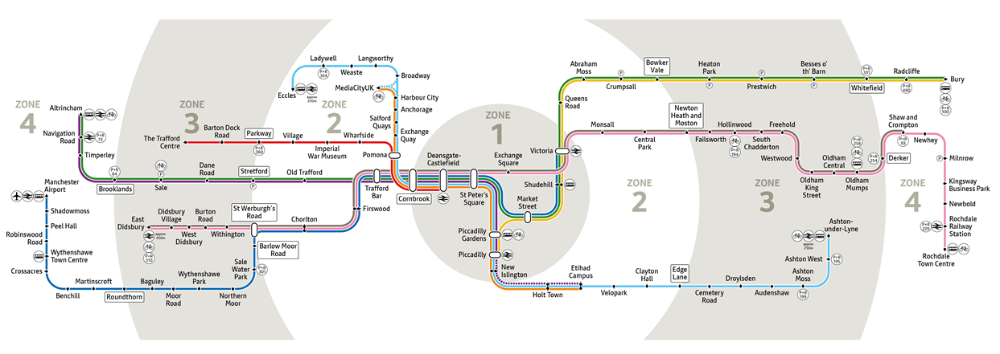
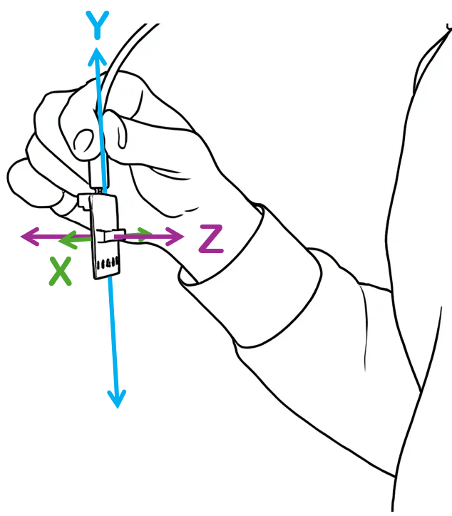
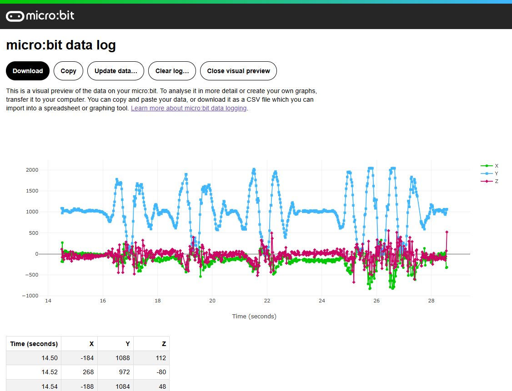
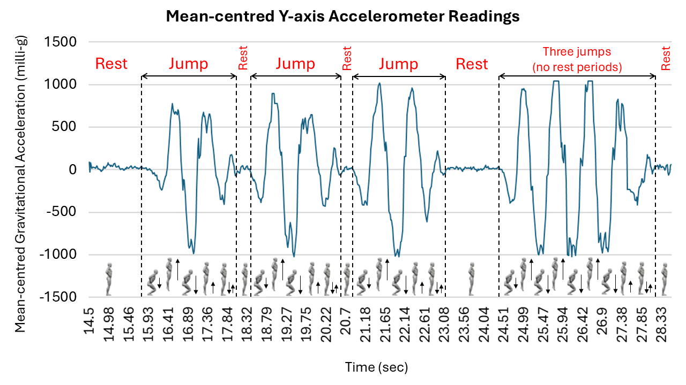

* Part-I Summer Project
:PROPERTIES:
:CUSTOM_ID: part-i-summer-project
:END:
| *Deadline:*         | *17:00 Friday (8th of May) End of Week 23* |
| *Assessment Mode:*  | *IN LAB DEMO IN YOUR WEEK 24 LAB SESSION*  |
| [[https://modules.lancaster.ac.uk/course/section.php?id=487761][MOODLE SUBMISSION]] |                                          |
|                   | [[https://forms.cloud.microsoft/Pages/ResponsePage.aspx?id=Ec2bnHqXnE6poLxzQJAWSiBBU6UiHFpGmj6rRi0EHmRUOUpGNFdPOVNQVTZPSzg4NTVXVjI4Vkg1Qy4u][REPOSITORY LINK SUBMISSION]]               |

** Aims
:PROPERTIES:
:CUSTOM_ID: aims
:END:
In this final term of your first year, there is a single task: a single
cross-module project that is designed to bring together all you have
learned since you joined us in October. This project represents the
final piece of practical coursework for your first year and constitutes
*33%* of the coursework assessment for the year. *Time to show us what
you can do!*

You have a /choice/ of projects to undertake from the choices below. You
need to *pick just one* of these projects. Read each of them carefully
before choosing which project to undertake. Please note that the
projects state which programming language you *must* use for that
project. These projects have been designed to build on what you have
learned in SCC.111, SCC.121 and SCC.131 (where applicable). Note that
some projects are unavailable / have different requirements for students
not studying SCC.131 (such as those studying for Computer Science and
Mathematics or Management and IT degrees).

** Getting Support
:PROPERTIES:
:CUSTOM_ID: getting-support
:END:
You should attend your timetabled SCC1x1 lab session *in weeks 21-23*
inclusive for support, where staff and teaching assistants will be
present to provide guidance, feedback and to answer your questions.
*Please note that your week 24 session will be reserved for you to
demonstrate the functionality of your work*. *Staff will not be able to
provide support during the Week 24 lab session.*

The FAST hub will also be available daily if you need additional drop-in
support. /See Moodle for more details./

** Submission and Assessment
:PROPERTIES:
:CUSTOM_ID: submission-and-assessment
:END:
This work will be assessed by a member of academic staff after you
follow the instructions below to submit your work. This assessment will
be further informed by a practical demonstration of your work. You will
be asked to present your work in your Week 24 lab session. Be prepared
to take the lead in demonstrating your project, and to answer questions
about it.

- You MUST submit your code to Moodle by the advertised deadline in a
  .zip file.

- You MUST demonstrate your work by downloading your Moodle submission
  and running it IN YOUR OWN WEEK 24 TIMETABLED LAB SESSION.

- You MUST ensure that your project can be compiled and executed FROM
  THE COMMAND LINE ON A LAB PC, without using an IDE. (If the project
  you selected has further instructions on how to compile and run your
  project, you must follow them.)

- The standard University regulation on permitting late submission of
  coursework DOES NOT APPLY TO THIS COURSEWORK ASSIGNMENT.

*FAILURE TO ADHERE TO THE ABOVE WILL RESULT IN A FAIL MARK (F4) BEING
RECORDED.*

** Version Control Submission
:PROPERTIES:
:CUSTOM_ID: version-control-submission
:END:
You *are expected* to use git version control for your project, and this
is reflected in the marking scheme. To submit your private Github
repository for assessment, you must do the following:

1. Regardless of the project you select, invite the ‘scc111-2026' github
   user as a collaborator, as shown in the lectures slides.
2. *Submit the FULL URL of your project repository (the same link that
   you'd need to ‘clone' it) using the form linked at the top of this
   page.*

** Marking Scheme
:PROPERTIES:
:CUSTOM_ID: marking-scheme
:END:
Your work will be marked based on the following categories. Your final
grade will be determined based on a weighted mean of these grades
according to the weighting shown in the table below.

| Marking Scheme                                                                                   |     |
|--------------------------------------------------------------------------------------------------+-----|
| *Project Functionality*                                                                            | *70%* |
|                                                                                                  |     |
| - See individual project descriptions below for indicative levels of the functionality required. |     |
| *Code Structure and Elegance*                                                                      | *10%* |
|                                                                                                  |     |
| - Modularity of code                                                                             |     |
| - Use of appropriate data types and libraries                                                    |     |
| - Use of appropriate language constructs (arrays, loops, functions, methods, classes)            |     |
| *Code Style*                                                                                       | *10%* |
|                                                                                                  |     |
| - Appropriate comments, code indentation                                                         |     |
| - Appropriate name/ scope of variables and functions/methods                                     |     |
| *Use of Git version control*                                                                       | *10%* |
|                                                                                                  |     |
| - Clean and regular commits                                                                      |     |
| - Appropriate commit messages                                                                    |     |

In all cases a grade descriptor (A, B, C, D, F) will be used to mark
your work in each category. The following sections provide an indication
of the level of functionality expected.

Students may also award of a distinction (+) category overall if they
feel a piece of work exhibits clearly outstanding practice. If you feel
your work warrants a distinction for going significantly above and
beyond the specification, *it is your responsibility to state and
demonstrate this during your Week 24 lab session*.

** Plagiarism
:PROPERTIES:
:CUSTOM_ID: plagiarism
:END:
This project *should be entirely your own work*. In this context, that
means that it is reasonable to discuss ideas with others, but you should
not expect to study the code of another student, or to let them study
yours. Code examples taken from the lecture notes are acceptable, as
well as, *small* sections of code (a few lines, for example) from the
internet - but if it is in your code, you should be able to understand
and confidently explain what it does and how it works. The use of AI
tools to write code on your behalf is regarded as equivalent to copying
code from any external source.

** Use of AI Statement
:PROPERTIES:
:CUSTOM_ID: use-of-ai-statement
:END:
Lancaster University has adopted a Red-Amber-Green (RAG) categorisation
system to guide students on their use of Generative AI (Gen AI) tools in
summative assessment. This coursework is in the *RED Category; AI tools
cannot be used*. Students suspected of using AI tools in assessment
identified as category red, will be investigated in line with
institutional academic integrity procedures. For further information,
please refer to the [[https://www.lancaster.ac.uk/ai-policy][AI
Policy]]. If you are unsure about the use of AI tools in your
assessment, please consult your lab academic.

#+caption: RED Category; AI tools cannot be used

* Project 1: Snow Problem! (Language: Java)
:PROPERTIES:
:CUSTOM_ID: project-1-snow-problem-language-java
:END:
** Project Overview
:PROPERTIES:
:CUSTOM_ID: project-overview
:END:
Modelling simple games provide excellent challenges to test your
computer programming tasks. As such, we have prepared a task for you to
implement a digital version of a physical puzzle based board game called
“Snow Problem” by the Happy Puzzle Company. We want to you to create a
fully playable game in Java, following the object-oriented paradigm, it
should be well tested, include a good user interface, and make effective
use of the scalable, extensible design and version control. In other
words, this will be a full work out of all the concepts you learned in
last term's SCC111 lectures.

#+caption: Snow Problem

** Tasks
:PROPERTIES:
:CUSTOM_ID: tasks
:END:
Your task is to develop a digital version of the game Snow Problem. Snow
problem is a tile based puzzle game, based on a 5x4 grid of squares.
There are four types of pieces in the game - trees, large snowballs,
small snowballs and snow man heads. The game describes a number of
levels (80 in total, with increasing levels of challenge), each
containing up to three identical copies of each of these types of
pieces. An example image of the physical game is shown below:

#+caption: Level 1

The aim of the game is quite simple. To complete all the snowmen on the
board, by stacking the snowman heads, small snowballs and large
snowballs. However, there are of course rules that must be followed:

- Large and small snowballs can move horizontally or vertically across
  the board. Movement can however only be stopped by /any/ other piece.
  If a snowball is moved in a direction that has no obstacle, it will
  fly off the end of the game board, and the game is over.
- Snowballs can be moved any number of times - as long as they stay on
  the gameboard.
- Trees cannot me moved.
- Small snowballs can be stacked onto an adjacent large snowball, to
  form a snowball stack. Once a snowball has been stacked, that stack of
  two snowballs CANNOT then be moved, or separated.
- A snowman's head cannot be moved like snowballs. Snowman heads can
  only be stacked onto an adjacent snowball stack.
- Once all snowballs and heads have been stacked, the game has been won!

Your challenge is to implement this game in the best way you can. To
help you complete the task, we have created some graphics you can use.
You will find them in
[[https://livelancsac-my.sharepoint.com/:u:/g/personal/aref_lancaster_ac_uk/IQDtEwAT6PCHRKJYm7g0N8BpAVTxPjG2nxLymUHhdRQNPdQ?e=pyrA4D][in
this zip file]]. Feel free to use these in your project. If you prefer
to create your own graphics, you are of course free to do so.

This project is arranged as a sequence of tasks. The more tasks you
complete successfully, the higher the grade you will receive. In
addition, you are required to comment your work and use git version
control throughout the project, as described in the lab project
documentation.

Finally, please remember the you are NOT permitted to use generative AI
in any software that you create. Doing so will constitute a serious case
of plagiarism, and will likely result in you being referred to the
Universities standing academic committee with a recommendation that you
be expelled from the University. So please DO NOT do this.

*** Task 1: Setting the Scene
:PROPERTIES:
:CUSTOM_ID: task-1-setting-the-scene
:END:
- Create classes to represent the GameBoard.
- Using the graphics provided, create a user interface that can hold the
  main pieces of the game.
- Set up your game to represent level 1 of the game, as indicated by the
  image shown above.

*** Task 2: Basic Movement
:PROPERTIES:
:CUSTOM_ID: task-2-basic-movement
:END:
- Implement basic movement for your game, and update the screen
  accordingly.
- You should use mouse clicks to define which snowball to move, and its
  direction of travel.
- This should permit large and small snowballs to be moved around the
  board.
- The game should end if a snowball leaves the gameboard.
- Snowballs should obey the movement rules defined above.

*** Task 3: Stacking
:PROPERTIES:
:CUSTOM_ID: task-3-stacking
:END:
- Implement the rules for stacking of small on adjacent large snowballs.
- Implement the rule to permit a snowman head to be place onto a
  snowball stack.
- Detect the end of game when all snowmen have been fully stacked.
- Implement a total of three levels of the game, including the two
  outlined below.

*** Task 4:
:PROPERTIES:
:CUSTOM_ID: task-4
:END:
- Implement all remaining game levels, as indicated in
  [[https://livelancsac-my.sharepoint.com/:b:/g/personal/aref_lancaster_ac_uk/IQDsU2NXWYIIRo_THPP1C8ZlATCX8k7WzE8t1B5F_PCM0So?e=HxpiNz][this
  document]].
- Pay particular attention to implementing this with elegance. Ensure
  you create a simple and scalable mechanism to support new levels.
- Count the number of moves taken in the game, and show this on your
  GUI.
- Implement a game reset option to restart a level.
- Implement a persistent (saved) high score table for each level.

*** Task 5:
:PROPERTIES:
:CUSTOM_ID: task-5
:END:
- Implement a puzzle solver. :)
- Probably using recursion, create a general purpose algorithm capable
  of solving any of the puzzles in the game. note, this is a TOUGH
  challenge - not for the faint of heart! To get full marks, this needs
  to algorithmically explore the possible moves, and identify valid
  solutions. Maintaining a list of the solutions won't cut it...

** Marking Scheme
:PROPERTIES:
:CUSTOM_ID: marking-scheme-1
:END:
Marks will be awarded according to the marking scheme shown at the start
of this document. Marks for the ‘Functionality' section will be awarded
based on individual merit, but the following table gives an *indicative*
overview of the level of functionality expected for each grade band:

*SCC Major Students Studying SCC.111, SCC.121 and SCC.131*

| Grade | Description                                                                                      |
|-------+--------------------------------------------------------------------------------------------------|
| A*    | *Working program that meets the criteria for a A, and meets the requirements of Task 5*          |
| A     | *Working program that meets the criteria for a B, and meets the requirements of Task 4*          |
| B     | *Working program that meets the criteria for a C, and meets the requirements of Task 3*          |
| C     | *Working program that meets the criteria for a D, and meets the requirements of Task 2*          |
| D     | *Working program that meets the requirements of Task 1*                                          |
| F     | *No working program demonstrated, or program does not meet any of the requirements listed above* |

*SCC Joint Major Students Studying SCC.111 and SCC.121 only*

| Grade | Description                                                                                      |
|-------+--------------------------------------------------------------------------------------------------|
| A*    | *Working program that meets the criteria for a A, and meets the requirements of Task 4*          |
| A     | *Working program that meets the criteria for a B, and meets the requirements of Task 3*          |
| B     | *Working program that meets the criteria for a C, and meets the requirements of Task 2*          |
| C     | *Working program that meets the requirements of Task 1*                                          |
| F     | *No working program demonstrated, or program does not meet any of the requirements listed above* |

* Project 2: Journey Planner for Manchester Metrolink (Language: Java)
:PROPERTIES:
:CUSTOM_ID: project-2-journey-planner-for-manchester-metrolink-language-java
:END:
** Project Overview
:PROPERTIES:
:CUSTOM_ID: project-overview-1
:END:
Journey planners can be used to find the optimal route between two (or
more) given locations. They are widely used to plan journeys and can be
based on one, or more, modes of transport. The route may be optimised
based on different criteria; for example, the journey planner may output
the fastest route, the cheapest route or even the route with fewest
changes depending on the user's preferences.

For this coursework, you will develop a route planner for the Manchester
Metrolink based on average journey times which are provided to you in
the file
[[https://livelancsac-my.sharepoint.com/:x:/g/personal/aref_lancaster_ac_uk/IQDHI7wwP_CJR75CaIfnRjEvAblsiqVGnROY4sdMr9cohpw?e=M222nE][Metrolink_times_linecolour.csv]].
The file is divided into sections corresponding to each (color-coded)
transport line of the network. Each row in a section represents a single
connection between two stations on the corresponding transport line and
gives the starting station, final station, and the time to travel
between the stations as: From , To, Time (mins). You should assume that
it takes the same time to travel in the opposite direction. An example
of the information provided on journey times is given below. It says
that it takes 6 mins to travel from Bury to Radcliffe on the yellow line
and it takes 1 min to travel from Sale to Dane Road on the purple line.

#+begin_example
From, To, Time (mins)
yellow
Bury,Radcliffe,6
purple
Brooklands,Sale,1.5
Sale,Dane Road,1
#+end_example

** Tasks
:PROPERTIES:
:CUSTOM_ID: tasks-1
:END:
Your task is to develop a route planner for the Manchester Metrolink. An
image of the network is given below for illustrative purposes only
(note, not all lines are used in the provided file, and information in
the file may not exactly match the figure).

#+caption: Manchester metrolink route map, from
https://tfgm.com/ways-to-travel/tram/network-map. Map is provided for
illustrative purposes only. All of your results should be based on the
information given in the provided files which may not be exactly the
same as this map.

Your route planner should be based on the information and times in the
provided file, not on any other timings or information. *For testing
your code, we will use a new file with stations and times. The format of
this file will be the same as the one given for development, but
specific information on station names and times may differ.*

The program should:

- Read in information from the provided file to give station names and
  journey times between stations on different lines.
- Provide an interface that enables a user to specify a valid start and
  end station for their journey.
- Given a valid start and end station, compute a route between the two
  stations and output this route, including lines to travel on, journey
  time and changes.
- Enable users to specify constraints for optimising the journey,
  e.g. fewest changes, shortest time.

Full details of the expected functionality and grades are given in the
task descriptions below marking.

For the provided file, an example of the shortest time journey between
Salford Quays and Exchange Square, with list of all intermediate
stations and any changes is given below.

#+begin_example
,*** Minimal Time Route ***
Salford Quays on lightblue line
Exchange Quay on lightblue line
Pomona on lightblue line
,**  Change Line to red line ***
Pomona on red line
Cornbrook on red line
Deansgate/Castlefield on red line
,**  Change Line to pink line ***
Deansgate/Castlefield on pink line
St. Peter's Square on pink line
Exchange Square on pink line

Overall Journey Time (mins) =  17.0
Number of Changes =  2
#+end_example

The tasks that your program must perform are detailed below. The
allocation of marks for completing each of these tasks is described in
the Marking Scheme.

*** Task 1
:PROPERTIES:
:CUSTOM_ID: task-1
:END:
- Develop a user interface that enables users to input a start and end
  location for their journey
- Checks if user has inputted valid station names and keep asking for
  user to input station names until valid ones are given

*** Task 2
:PROPERTIES:
:CUSTOM_ID: task-2
:END:
- Given any valid start and end location, come up with any valid route
  between the two locations
- Output the route with the list of intermediate stations Note: for a C
  you can make the simplifying assumption to treat everything as one
  single line, so you do not also have to output the line name here. To
  get higher than a C, you must include the different lines and times -
  e.g. as in Task 3. You do not need to complete Task 2 if you are able
  to complete Task 3.

An example of an expected output for the given file with start Victoria
and end Old Trafford is given below. Note you can ouput any valid route
for this task.

#+begin_example
Victoria
Exchange Square
St. Peter's Square
Deansgate/Castlefield
Cornbrook
Trafford Bar
Old Trafford
#+end_example

*** Task 3
:PROPERTIES:
:CUSTOM_ID: task-3
:END:
- Give the shortest time route between a given start and end location.
  This should now include the fact there are different lines and you
  should make the simplifying assumption that changing trams takes 2
  mins each time. (In case there are multiple shortest routes, you can
  give any.)
- Output the route with the list of intermediate stations and lines and
  give the overall journey time
- *Only for SCC Major Students Studying SCC.111, SCC.121 and SCC.131*:
  Include explicit indication of where changes are needed when the
  journey is output (e.g. as in the example output given above)

An example of an expected output for the given file with start start
Victoria and end Old Trafford is given below *for SCC Major Students
Studying SCC.111, SCC.121 and SCC.131*

#+begin_example
Victoria on pink line
Exchange Square on pink line
St. Peter's Square on pink line
,**  Change Line to purple line ***
St. Peter's Square on purple line
Deansgate/Castlefield on purple line
Cornbrook on purple line
Trafford Bar on purple line
Old Trafford on purple line
Overall Journey Time (mins) =  16.5
#+end_example

An example of an expected output for the given file with start start
Victoria and end Old Trafford is given below for *SCC Joint Major
Students Studying SCC.111 and SCC.121 only*

#+begin_example
Victoria on pink line
Exchange Square on pink line
St. Peter's Square on pink line
St. Peter's Square on purple line
Deansgate/Castlefield on purple line
Cornbrook on purple line
Trafford Bar on purple line
Old Trafford on purple line
Overall Journey Time (mins) =  16.5
#+end_example

*** Task 4
:PROPERTIES:
:CUSTOM_ID: task-4-1
:END:
- Enable users to select journey constraints. Include at least the
  options of choosing the route with shortest time vs route with fewest
  changes (fewest changes route must be a Metrolink route, not a walking
  route).
- As well as the overall journey time, also give the total number of
  changes for the computed route and indicate where changes are needed
  when outputting the route.

An example of the expected output for the given file when the option to
minimise changes is chosen with start Victoria and end Old Trafford is
given below

#+begin_example
,*** Route with Fewest Changes ***
Victoria on green line
Shudehill on green line
Market Street on green line
St. Peter's Square on green line
Deansgate/Castlefield on green line
Cornbrook on green line
Trafford Bar on green line
Old Trafford on green line
Time (mins): 20.0
Total Changes: 0
#+end_example

*** Task 5
:PROPERTIES:
:CUSTOM_ID: task-5-1
:END:
- *Only for SCC Major Students Studying SCC.111, SCC.121 and SCC.131:*
- The user interface for inputting start and end locations as well as
  constraints (e.g. shortest time vs fewest changes) should be a GUI.

** Getting Started
:PROPERTIES:
:CUSTOM_ID: getting-started
:END:
- Refresh your knowledge of graphs, as well as the algorithms on graphs
  that we covered in the 121 lectures
- If you aim to implement the journey planner using a graphical
  interface, then refresh your knowledge of the Swing classes discussed
  in 111 lectures
- You may find the java collections API useful. This has a set of data
  structures, further details are provided here
  https://docs.oracle.com/javase/8/docs/technotes/guides/collections/overview.html

** Marking Scheme
:PROPERTIES:
:CUSTOM_ID: marking-scheme-2
:END:
Marks will be awarded according to the marking scheme shown at the start
of this document. Marks for the ‘Functionality' section will be awarded
based on individual merit, but the following table gives an *indicative*
overview of the level of functionality expected for each grade band:

*SCC Major Students Studying SCC.111, SCC.121 and SCC.131*

| A* | *Working program that meets the criteria for a A, plus:*                                    |
|    |                                                                                             |
|    | - Meets the requirements of Tasks described under Star Award                                |
| A  | *Working program that meets the criteria for a B, plus:*                                    |
|    |                                                                                             |
|    | - Meets the requirements of Tasks 4 and 5                                                   |
| B  | *Working program that meets the criteria for a D, plus:*                                    |
|    |                                                                                             |
|    | - Meets the requirements of Tasks 3                                                         |
| C  | *Working program that meets the criteria for a D, plus:*                                    |
|    |                                                                                             |
|    | - Meets the requirements of Task 2                                                          |
| D  | *Working program that:*                                                                     |
|    |                                                                                             |
|    | - Meets the requirements of Task 1                                                          |
| F  | *No working program demonstrated, or program does not meet any* *requirements listed above* |

*SCC Joint Major Students Studying SCC.111 and SCC.121 only*

| A* | *Working program that meets the criteria for a A, plus:*                                    |
|    |                                                                                             |
|    | - Meets the requirements of Tasks described under Star Award                                |
| A  | *Working program that meets the criteria for a B, plus:*                                    |
|    |                                                                                             |
|    | - Meets the requirements of Task 4                                                          |
| B  | *Working program that meets the criteria for a D, plus:*                                    |
|    |                                                                                             |
|    | - Meets the partial (as in description) requirements of Tasks 3                             |
| C  | *Working program that meets the criteria for a D, plus:*                                    |
|    |                                                                                             |
|    | - Meets the requirements of Task 2                                                          |
| D  | *Working program that:*                                                                     |
|    |                                                                                             |
|    | - Meets the requirements of Task 1                                                          |
| F  | *No working program demonstrated, or program does not meet any* *requirements listed above* |

** Star Award
:PROPERTIES:
:CUSTOM_ID: star-award
:END:
To get an A+, in addition to the above tasks, you must include the
following extra functionality (or at our discretion equivalent advanced
features beyond the spec).

- As well as outputting the route as a list with changes and lines you
  should also produce a visualisation of the computed route. To do this
  you should not use any existing graph plotting libraries.
- Your journey planner should also be able to account for delays or
  station closures as well as also include the option of walking between
  stations as part of the journey.
  - You should enable a user to input details of any stations that are
    closed as well as specify delays on lines by inputting new times
    that it takes to travel between stations. You should enable any
    number of station closures or delays to be specified by the user.
    The new journeys should be computed based on this new information.
  - For the option of walking between stations you should use the times
    given in the provided file
    [[https://livelancsac-my.sharepoint.com/:x:/g/personal/aref_lancaster_ac_uk/IQBcTtBkUMMQSZg8fMg5VWnNAU5L9a9HxAgYr-NeQGB26L4?e=HFHMMR][walktimes.csv]],
    this file gives a matrix of the times in minutes to walk between
    each station. Here the indivudual station names are given in the
    first column and row, with the corresponding time to walk between
    stations given as a cell in the matrix (clearer to see if file is
    opened as spreadsheet, for example opened in excel). Again, to test
    your code we will use a new file with a new set of walking times
    where the times and stations may differ.
  - Your journey planner should again compute the shortest time journey
    and the journey with fewest changes, but this should now include the
    information on station closures and delays as well as the
    possibility of walking.

* Project 3: Personalised Jump Counter (C/C++, ARM Assembly, Java)
:PROPERTIES:
:CUSTOM_ID: project-3-personalised-jump-counter-cc-arm-assembly-java
:END:
** Project Overview
:PROPERTIES:
:CUSTOM_ID: project-overview-2
:END:
Smartphones and smartwatches have become a widely used platform for
monitoring a user's physical activity. They typically rely on built‑in
accelerometer sensors to capture motion data. Using this information,
they run algorithms that infer the user's direction, motion patterns,
and overall activity level from raw acceleration readings.

This project focuses on designing and implementing a personalised
jump‑tracking and counting algorithm using a low‑cost embedded system
such as the BBC micro:bit.

The objectives of the project are:

- To acquire accelerometer readings from the micro:bit and analyse
  jump‑related motion patterns that will guide the design of a
  personalised jump‑tracking algorithm.

- To develop code in C/C++ *and* ARM Assembly for the micro:bit that
  accurately converts accelerometer data into a jump count, displays the
  count on the 5×5 LED display, and records all activity in a log file.

- To develop code in C/C++ *or* Java that runs on a lab computer,
  processes activity data from a properly-formatted version of the log
  file, and displays key metrics on a lab monitor, such as peak‑exertion
  intervals and the highest number of consecutive jumps.

- To boost your fitness through rigorous testing of your software
  product! Alas, your improved fitness will not be assessed.

** Phase 1: Research and Design
:PROPERTIES:
:CUSTOM_ID: phase-1-research-and-design
:END:
Accelerometers are sensors that measure the rate of change of an
object's velocity over time along all three spatial dimensions (X, Y and
Z). Acceleration is measured in meters per squared meter (m/s^{2}) or in
*g*, where *one g* (or, equivalently, *1000 milli-g*) represents the
Earth's standard gravitational force (g-force) that acts on a unit of
mass. For example, zero gravity or 0g is experienced in free fall;
astronauts typically experience 3g to 4g during a rocket launch; pilots
of fighter jets endure up to 9g during combat maneuvers.

Accelerometers are used in machinery to monitor vibrations, in buildings
and infrastructure to detect earthquakes, in navigation systems to
determine orientation and support stabilisation, and in smart personal
devices to track movement and physical activity.

The CODAL C runtime environment offers an accelerometer class, which can
access the accelerometer on board the micro:bit. *Acceleration in each
dimension is measured in milli-g*. Event‑driven programming can be used
to create a simple script in C that raises an event each time the
accelerometer generates new data, and triggers an event handler to log
those measurements in a file.

*** Accessing and Interpreting Readings of the Accelerometer
:PROPERTIES:
:CUSTOM_ID: accessing-and-interpreting-readings-of-the-accelerometer
:END:
To illustrate how the accelerometer class can be used in practice, let
us walk through an example. Recall that the file =main.cpp= is located
in the subfolder =source= of the microbit folder on your h-drive.
Imagine that =main.cpp= creates a =MicroBit= object, called =uBit=, and
sets up a listener in the =main()= function to monitor the
accelerometer:

<<cb7>>
#+begin_src sourceCode
 uBit.messageBus.listen(MICROBIT_ID_ACCELEROMETER,
 MICROBIT_ACCELEROMETER_EVT_DATA_UPDATE, onAccelerometerData);
#+end_src

The event handler =onAccelerometerData()= collects accelerometer
readings in all three dimensions using the methods
=uBit.accelerometer.getX()=, =uBit.accelerometer.getY()= and
=uBit.accelerometer.getZ()=, and saves them in the default log file
=MY_DATA.HTM=. The source file =main.cpp= is compiled and the executable
file =MICROBIT.hex= is transferred to a micro:bit device, which is held
by a user as shown in Fig. 3.1, i.e., the circuit board is positioned
vertically - relative to the floor - with its long edge facing the floor
and the 5×5 LED display facing the body of the user.

#+caption: Fig. 3.1: Adjusting micro:bit's orientation to maximise
changes in acceleration along the Y‑axis.

To test the sensor, the user *jumps six times* while holding the
micro:bit as depicted in Fig. 3.1. More specifically, the user *rests
briefly between each of the first three jumps*, then performs the next
*three jumps without resting*. The accelerometer readings, which have
been saved in the data file =MY_DATA.HTM=, can be displayed in a web
browser and visualised as a function of time after clicking the “Visual
Preview” button on the web page, as shown in Fig. 3.2.

#+caption: Fig. 3.2: Visual preview of accelerometer data along the X,
Y, and Z axes, sampled every 0.02 seconds.

The X and Y axes record minor wobbling motions that occur during the
jump; these readings are not essential for the analysis and can be
ignored. If the “Download” button on the web page is pressed (see Fig.
3.2), the accelerometer data will be exported to a Comma-Separated
Values (CSV) file, which can be subsequently loaded into a spreadsheet
application, such as /Microsoft Excel/, /LibreOffice Calc/ or /Apple
Numbers/, for further analysis.

As can be seen in Fig. 3.2, the measurements along the Y axis taken
*before the first jump* provide a baseline from which the sensor's
acceleration can be determined when the micro:bit is *stationary*. If
this baseline value, which represents the mean (average), is subtracted
from all Y-axis measurements (in Excel, Calc or Numbers), the plot will
be centred around zero, as illustrated in Fig. 3.3. The data
transformation technique of subtracting the mean of a variable from all
measurements is called /mean centering/.

#+caption: Fig. 3.3: Mean centering of the Y-axis measurements presented
in Fig. 3.2. The value of the subtracted mean in this example is 1025
milli-g. Analysis of this plot can reveal movement patterns associated
with each jump.

The plot in Fig. 3.3 captures the user's individual ‘jump profile',
which can vary from person to person. Peaks and troughs in the curve,
i.e., local maxima and local minima, separated by zero crossings
represent trends and trend reversals in movement, which synthesise each
jump. Observe that *different jump types* in Fig. 3.3, e.g., jumps with
rest intervals in between or continuous jumps, generate *different
‘signatures'* in the accelerometer readings.

#+begin_quote
📣 *Key takeaway:* Careful examination of a person's jump profile will
identify characteristic patterns for each jump type, which will guide
the design of an algorithm in C/C++ that will enable the micro:bit to
estimate the number of jumps in real time from accelerometer data.
#+end_quote

*** Obtain and Analyse your own Jump Profile
:PROPERTIES:
:CUSTOM_ID: obtain-and-analyse-your-own-jump-profile
:END:
Your task for Phase 1 of this project is to develop C code for the
micro:bit that stores accelerometer readings into a log file. You should
then collect accelerometer measurements while you perform different
types of jumps, analyse the recorded data in a spreadsheet application
to identify motion patterns, and understand the characteristics of your
jump profile.

The task can be divided into three steps:

1️⃣ Implement event listeners and event handlers in =main.cpp= for
*Button A*, *Button B*, and the *accelerometer* on board the micro:bit.
Each click of *Button A* should toggle the recording state between
/enabled/ (1) and /disabled/ (0). A click of *Button B* should clear the
contents of the log file. New *accelerometer* readings should be logged
if recording is enabled.

2️⃣ Compile the C source file and transfer =MICROBIT.hex= to your
micro:bit. Design a short routine featuring *at least two types of
jumps*. Press *Button A* to enable recording, stand still for a couple
of seconds and then perform the routine _while holding the micro:bit as
in Fig. 3.1_. After completing the routine, press *Button A* to stop
recording. If you want to repeat the routine and reset the log file,
press *Button B*.

3️⃣ *Disconnect* your micro:bit from the USB port, then *reconnect* it.
The updated data file =MY_DATA.HTM= should appear in the MICROBIT drive.
Open it in a web browser to check whether acceleration and changes in
acceleration over time along the Y‑axis of the accelerometer are greater
than those on the X and Y axes, as in Fig. 3.2. Press “Download” to
export the file in CSV format, open it in Excel, Calc or Numbers, and
*analyse each jump type*, as in Fig. 3.3.

💡Links to relevant SCC.131 material:

- Event listeners and handlers for buttons A and B:
  [[https://modules.lancaster.ac.uk/pluginfile.php/4187400/mod_label/intro/SCC131-Week08-Lecture01.pdf?time=1762270218835][Lecture
  notes on Sensors and Logging]] |
  [[https://lancaster-university.github.io/microbit-docs/ubit/button/][API]]

- Event listeners and handlers for the accelerometer:
  [[https://lancaster-university.github.io/microbit-docs/ubit/accelerometer/][API]]

- Logging with micro:bit:
  [[https://modules.lancaster.ac.uk/pluginfile.php/4187400/mod_label/intro/SCC131-Week08-Lecture01.pdf?time=1762270218835][Lecture
  notes on Sensors and Logging]] |
  [[https://microbit.c272.org/guides/logging/][DOCS v2 by c272]]

- Online download tool for HEX files if dragging and dropping
  =MICROBIT.hex= on to the MICROBIT drive does not work:
  [[https://microbit.org/tools/webusb-hex-download-tool/][micro:bit hex
  download tool]]

⚠️ *You should not use the built-in GESTURE events and GESTURE methods of
the accelerometer class.* Focus on the processing of raw accelerometer
data using the =getX()=, =getY()= and =getZ()= methods.

** Phase 2: Development and Testing
:PROPERTIES:
:CUSTOM_ID: phase-2-development-and-testing
:END:
Phase 2 of the project proceeds on the assumption that you have a clear
understanding of *what qualifies as a jump of a particular type in the
accelerometer data*, which was the objective of Step 3 of Phase 1.

For Phase 2, you are expected to develop code for the micro:bit that
collects accelerometer readings as before, but rather than writing them
to a data file, your program should process the data in real time and
display on the 5×5 LED screen an *up arrow* or *down arrow* when
*upward* or *downward* movement is detected.

Using Fig. 3.3 as a reference, *upward movement* is defined as the
transition from negative mean-centred values to positive mean-centred
values. This event is referred to as a *zero up-crossing*. On the other
hand, *downward movement* implies a *zero down-crossing*, i.e., a
transition from positive mean-centred values to negative mean-centred
values.

The task can be divided into two steps:

1️⃣ Use knowledge gained from SCC.111-Software Development to *write a
program in standard C/C++* (i.e., include standard libraries instead of
=MicroBit.h=) *that runs on a lab computer and reads the CSV file
produced in Step 2 of Phase 1*. Create a function that treats every line
of the file as a new accelerometer reading, isolates the Y-axis
measurement, subtracts the mean from the measurement, compares the
result with previously stored mean-centred measurements, and determines
if a zero up-crossing or a zero down-crossing has occurred. Depending on
the event that has been detected, the function should print the message
“Upward movement” or “Downward movement” on the lab monitor, along with
the timestamp or the index of the measurement at which the event was
detected. Test your code to verify that the printed messages accurately
reflect the transitions displayed in the plot produced in Step 3 of
Phase 1.

2️⃣ When you are satisfied that your C/C++ code reliably identifies
upward and downward motion in acceleration data stored in a file, shift
your focus to *writing C/C++ code that will enable the micro:bit to
detect upward and downward motion in real time*. Integrate the function
that you developed in the previous step into =main.cpp=. Instead of
printing messages on an external monitor, the function should display an
up arrow (↑) or a down arrow (↓) on the 5×5 LED screen of the micro:bit
when upward or downward movement is detected. If neither upward nor
downward movement is detected, the LED screen should be cleared. Compile
your source code, transfer =MICROBIT.hex= to your micro:bit device and
test it.

#+begin_quote
📣 *Sensitivity to micro-movements:* Your code should be detecting even
subtle motions, which could be causing the direction of the arrow on the
LED display to constantly change. To see this in action,
[[https://estream.lancaster.ac.uk/View.aspx?id=94937~5t~O4DpRBCI6C][watch
this short video]]. When counting jumps, micro-movements should be
treated as ‘noise' and ignored. This is the objective of the next
development phase.
#+end_quote

💡Links to relevant SCC.131 material:

- Displaying images and controlling the 5×5 LED screen of the micro:bit:
  [[https://modules.lancaster.ac.uk/pluginfile.php/4187400/mod_label/intro/SCC131-Week07-Lecture02.pdf?time=1762431017459][Lecture
  notes on Using the Display]] |
  [[https://lancaster-university.github.io/microbit-docs/ubit/display/][API]]

- Online download tool for HEX files if dragging and dropping
  =MICROBIT.hex= on to the MICROBIT drive does not work:
  [[https://microbit.org/tools/webusb-hex-download-tool/][micro:bit hex
  download tool]]

** Phase 3: Refinement and Calibration
:PROPERTIES:
:CUSTOM_ID: phase-3-refinement-and-calibration
:END:
*The next two phases are more challenging and more creative, but call
for greater initiative and independent decision‑making on your part.*

As in Phase 2, you are encouraged to refine the code you developed in
standard C/C++ using the accelerometer data in the CSV file as input.
When you are satisfied that you code can accurately estimate the number
of jumps in the CSV file, transfer the relevant functions to =main.cpp=,
upload the updated =MICROBIT.hex= to your micro:bit device and test your
code in practice. Calibrate the logic in your counting method to
minimise or eliminate overcounting or undercounting of jumps. _Aim for a
relative error of 25% or smaller_, i.e., if you jump 40 times, the
reported jump count should be between 30 and 50.

The task of Phase 3 can be divided into three steps:

1️⃣ *Filter out micro-movements:* Instead of handling ‘raw' accelerometer
data, consider passing the data through a
[[https://towardsdatascience.com/time-series-from-scratch-moving-averages-ma-theory-and-implementation-a01b97b60a18/][Simple
Moving Average (SMA) filter]], which is commonly used to smooth out
short-term fluctuations (noise) and identify trends in a *time series*,
i.e., a sequence of data points plotted over time. The SMA filter uses a
*sliding window of size N*/, which moves over the accelerometer data.
For every time step/ j/, the SMA filter calculates the mean of the last/
N* accelerometer values, i.e., from /j/-/N/+1 to /j/, and assigns the
mean to a new data point at position /j/. For example, for a sliding
window of size /N/=3, the value of the data point at time step /j/=10
will be the average of the mean-centred accelerometer readings at time
steps 8, 9 and 10.

- Use knowledge gained in SCC.121-Fundamentals of Computer Science to
  represent a *sliding window of size /N/* as an integer array of /N/
  elements, where a new element pushes the oldest element out in
  accordance with the First‑In First‑Out (FIFO) principle.

- Develop a function in ARM Assembly (inline or external) that *returns
  the average of the /N/ values in the sliding window*. For testing
  purposes, this function could be initially written in C/C++ and then
  converted into ARM Assembly.

2️⃣ *Focus only on major changes in acceleration:* A jump triggers a
pattern of alternating small and large fluctuations in acceleration. We
use the term *transition magnitude* to describe the absolute difference
between two consecutive local extrema of opposite type, e.g., a local
minimum and a local maxmimum, separated by a zero crossing. Major
transitions are characterised by a large magnitude, whereas minor
transitions are characterised by a small magnitude. Revisit the analysis
of your personal jump profile (obtained in Step 3 of Phase 1) to
*determine a threshold /θ/* above which a transition is classified as
major; transitions falling below this threshold are minor and will be
ignored.

3️⃣ *Translate patterns of major acceleration changes into jumps:* Based
on your personal jump profile, decide on the values of /N/ (size of
sliding window) and /θ/ (threshold for the magnitude magnitude) and
define each type of jump as a sequence of major upward and/or downward
transitions. You may not need to consider both upward and downward
trasitions but you may have to take into accout the time interval
between transitions. For example, the first three jumps in Fig. 3.3 are
all characterised by two major downward transitions followed by a short
period of inactivity. Display the number of jumps on the LED screen of
the micro:bit and introduce additional features that give users the
option to pause, restart and reset the counter, enable/disable data
logging and clear the log file. For an example of the jump counter in
operation,
[[https://estream.lancaster.ac.uk/View.aspx?id=94954~5s~mgnNgqrozK][watch
this short video]].

** Phase 4: User Experience
:PROPERTIES:
:CUSTOM_ID: phase-4-user-experience
:END:
Hardware and low‑level software in smart devices are essential but tend
to feel more abstract or inaccessible to the average user. For this
reason, users often take them for granted and gravitate toward front‑end
software because this is the part of the echnology they can see and
interact with. Front-end software shapes user experience.

*Your task for Phase 4 is to develop a software app for the lab
computers that improves the jump counter's user experience. You can use
C, C++ or Java for code development. Don't forget to choose a cool name
for your app.*

The _minimum requirement_ for the app is to read the downloaded CSV file
and output in text form at least two useful metrics in addition to the
estimated total number of jumps. For example, the app could report
peak-exertion intervals and the highest number of consecutive jumps.

Students who wish to push their limits could develop an app that reads
the accelerometer data directly from the log file =MY_DATA.HTM=, plots
activity information in a graphical interface and reports at least three
useful metrics in addition to the estimated total number of jumps.

** Marking Scheme
:PROPERTIES:
:CUSTOM_ID: marking-scheme-3
:END:
Marks will be awarded according to the marking scheme shown at the start
of this document. Marks for the ‘Functionality' section will be awarded
based on individual merit, but the following table gives an *indicative*
overview of the level of functionality expected for each grade band: 

| *A* | All objectives for grade B have been met and a working program in C/C++ or Java that meets the following specifications has been demonstated on a lab machine:                                                                                                       |
|   | - Accelerometer data are directly read from the log file =MY_DATA.HTM=..                                                                                                                                                                                               |
|   | - In addition to the estimated total number of jumps, two or more useful metrics are calculated and displayed on a lab monitor.                                                                                                                                      |
|   | - Accelerometer data and metrics are visualized in a graphical user interface.                                                                                                                                                                                       |
| *B* | All objectives for grade C have been met, plus:                                                                                                                                                                                                                      |
|   | - Code in C/C++ that implements a Simple Moving Average (SMA) filter and calls an averaging function that has been written in ARM Assembly (Step 1 of Phase 3).                                                                                                      |
|   | - Working C/C++ program that runs on a micro:bit device, employs both an SMA filter and thresholding to count jumps in real time, and achieves a relative error that is higher than 10% but lower than or equal to 25% (Step 2 and first part of Step 3 of Phase 3). |
|   | - Additional features that enable the micro:bit to control the jump counter and record data to =MY_DATA.HTM= (Last part of Step 3 of Phase 3).                                                                                                                         |
| *C* | All objectives for grade D have been met, plus:                                                                                                                                                                                                                      |
|   | - Working C/C++ program that runs on a lab computer, reads CSV files that contain accelerometer readings, and idenities upward and downward motion in accelerometer data (Step 1 of Phase 2).                                                                        |
|   | - Working C/C++ program that runs on a micro:bit device, detects upward and downward motion in real time, and displays an up arrow or a down arrow, respectively (Step 2 of Phase 2).                                                                                |
| *D* | The following objectives have been met:                                                                                                                                                                                                                              |
|   | - Working C/C++ program for the micro:bit that collects accelerometer readings and stores them in the default log file =MY_DATA.HTM= has been developed and demonstrated (Steps 1, 2 of Phase 1).                                                                      |
|   | - Accelerometer readings for a jumping routine have been exported in a CSV file and analysed in a spreadsheet application, and key characteristics of different types of jumps have been determined (Step 3 of Phase 1).                                             |
| *F* | No working code was demonstrated, or the code did not meet any of the above project objectives.                                                                                                                                                                      |

** Star Award
:PROPERTIES:
:CUSTOM_ID: star-award-1
:END:
Students who meet all project objectives for an A will receive a /Star
Award/ for ‘Functionality' (i.e., full marks). A /Star Award/ (i.e.,
bonus marks) is also available for students who do not meet all project
objectives but their jump counter achieves *a relative error of 10% or
lower*.
